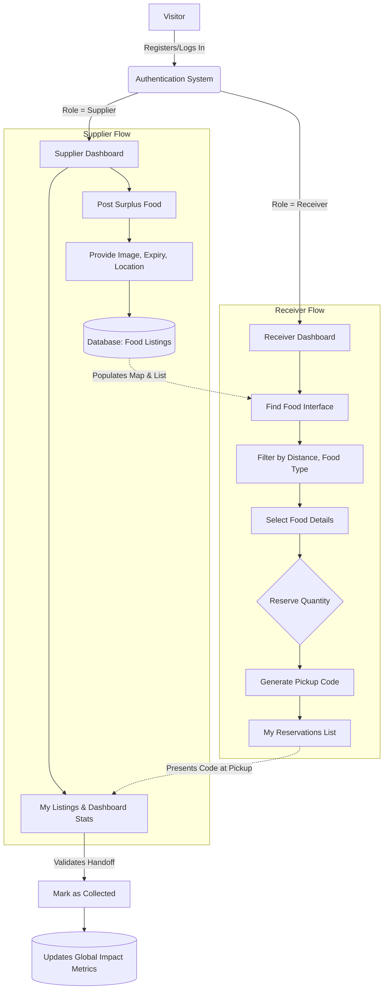

# SurplusShare

> **Save Food. Share Good.**

## Problem Statement
Every year, vast amounts of edible, perfectly safe food are wasted by restaurants, caterers, and grocery stores due to overproduction or nearing expiry dates. At the same time, many communities and local organizations struggle with food insecurity. The gap between surplus food and the people who need it represents both a massive environmental challenge and a missed humanitarian opportunity.

## Proposed Solution
**SurplusShare** bridges this gap by providing a real-time, hyperlocal MERN stack platform where local businesses can instantly list their surplus food offerings, and community members or NGOs can reserve and collect the food before it goes to waste. The platform facilitates secure, direct connections, ensuring excess food is rescued efficiently, transparently, and sustainably.

## Key Features
- **Geospatial Food Discovery**: An interactive map view allowing receivers to locate surplus food near them in real-time.
- **Live Dietary & Expiry Tracking**: Clear visual indicators for food safety, expiry countdowns, and dietary categorizations.
- **Role-Specific Dashboards**: Tailored UI experiences for 'Suppliers' to track active donations, and for 'Receivers' to manage pickups.
- **Impact Metrics**: Tracking statistics visualizing the platform's environmental and social impact (e.g., meals rescued, successful pickups).
- **Reservation System**: Secure, quantity-controlled reservations with unique auto-generated pickup codes ensuring seamless handoffs.

## Technologies Used
- **Frontend**: React (Vite), Tailwind CSS v4 for utility-first styling, React Router, Lucide Icons.
- **Mapping UI**: React-Leaflet, Leaflet.js
- **Backend / API**: Node.js, Express.js.
- **Database**: MongoDB (Local/Atlas), Mongoose ODM.
- **Authentication**: JSON Web Tokens (JWT), Bcrypt for secure password hashing.

## Website Workflow

## Implementation Details
- **Architecture**: Designed on standard REST architecture principles, heavily decoupling the frontend (React) which interacts with the backend Express API routes asynchronously via Axios.
- **Seeding & Demonstration**: A robust built-in seed script (`server/src/utils/seed.js`) instantiates fully realized test accounts (Supplier, Requestor, Admin) alongside simulated coordinates assigned in Bengaluru to showcase platform scalability.
- **Security Protocol**: Routes are heavily protected using bearer token JWT middleware. Suppliers cannot post without a verified profile, and receivers cannot request invalid or expired amounts.

## Future Scope
- **Real-Time Notification & Chat**: Enhance the coordination between receivers and suppliers during handoff via WebSockets.
- **AI Smart Matching**: Predict surplus food likelihood based on historical restaurant data, and proactively notify frequently engaged local NGOs.
- **Route Optimization**: Provide integrated GPS routing recommendations, minimizing the transport time and carbon footprint for receivers hitting multiple pickup spots on an "errand run".
- **Gamification**: Implement a points system giving suppliers community verification badges and receivers rewards for consistent pickups.

## References / Bibliography
- React.js Official Documentation: [https://react.dev/](https://react.dev/)
- React-Leaflet Map Documentation: [https://react-leaflet.js.org/](https://react-leaflet.js.org/)
- TailwindCSS v4 Setup & Utilities: [https://tailwindcss.com/](https://tailwindcss.com/)
- Express.js Node Routing Best Practices: [https://expressjs.com/](https://expressjs.com/)
- Mongoose ODM Guide: [https://mongoosejs.com/](https://mongoosejs.com/)
